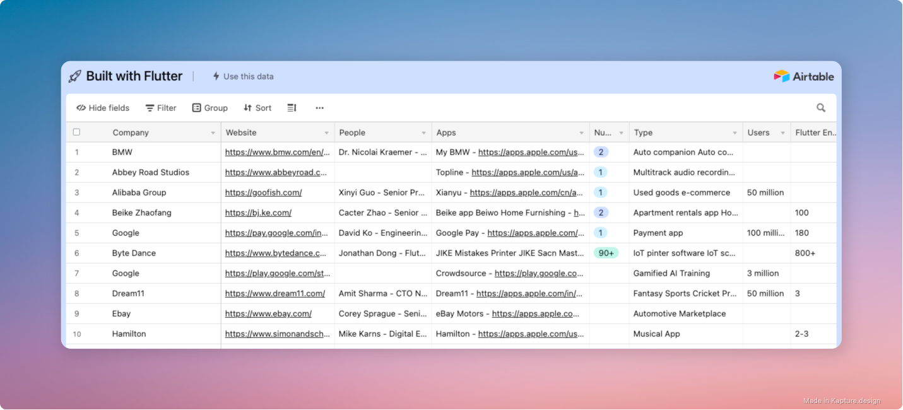

# Built with Flutter

A list of companies using Flutter

We track the adoption of Flutter in the startup and corporate worlds. We shine a spotlight on these companies to help promote the adoption of Flutter.

## Companies using Flutter (Click the image)

# Frequently Asked Questions

## Why is this data useful?

We'd like to answer the following questions:
- Which companies are adopting Flutter?
- How big are these teams?
- Which industries are adopting Flutter?
- Which regions are adopting Flutter the fastest?
- Who are the key decision makers?

## Who is this list for?

For tech leaders and decision makers:
- This list provides some insight into how other companies have used Flutter to build their applications
- This can give you an idea of whether Flutter would be a good fit for your company

For students and software engineers:
- It is important to know whether learning Flutter is worth the investment
- Is Flutter adoption on the rise?
- Are there job opportunities as a Flutter developer?

## What is the source of this information?

All data points in our list are publicly available.

This includes:
- Job postings
- Flutter showcases
- Blog posts
- Social media posts
- Press releases
- Corporate websites

## Contributions

If you know a company that is using Flutter please create a PR.

In your PR provide the company name and a source for the data point, that's it!

Contributions must meet the following criteria:

- [ ] The company is a startup or corporation and has more than 5 employees
- [ ] The information must be public and must include a source